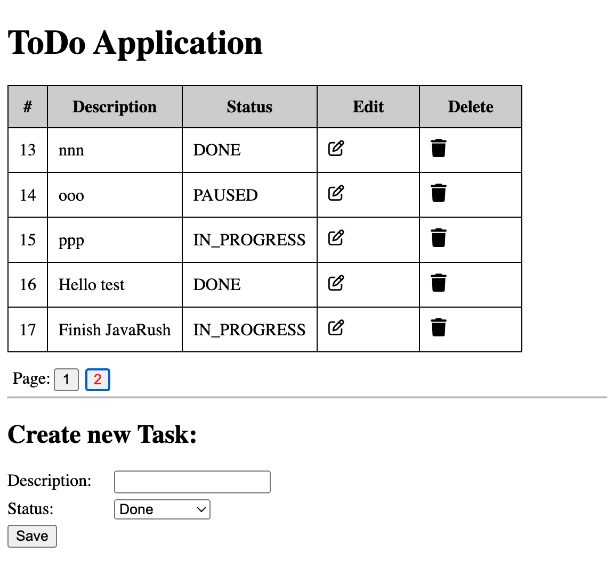
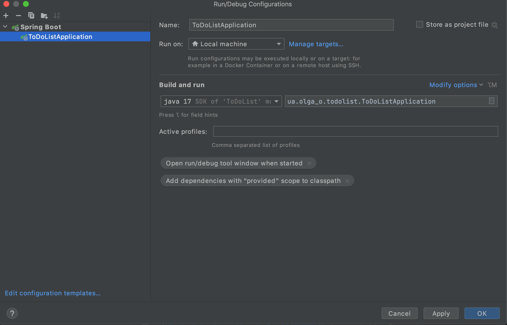

# Project: Spring I - CRUD with Spring MVC

Learning project with Spring.

Application to manange ToDo list tasks

- Allow create, update, delete Tasks
- Show list of all tasks
- Paginations

# Technical stack

- Java 17
- Spring Boot 3.2
- JPA
- Thymeleaf
- MySQL
- Docker-Compose
- Lombok
- Flyway (migration)

#  How to Run application

- Run docker-compose from project run (`docker-compose up`)
- Open project with IntelliJ IDEA
- Install required Maven dependency
- Run app

Here an example configuration with IntelliJ IDEA

With start a docker-compose, new mysql v8 container will be started and flyway will apply migration to 
set an initial DB version.

